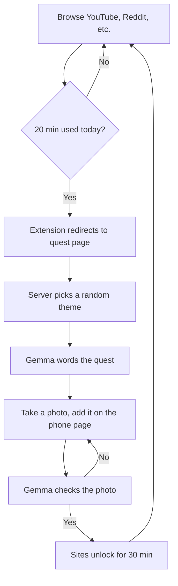
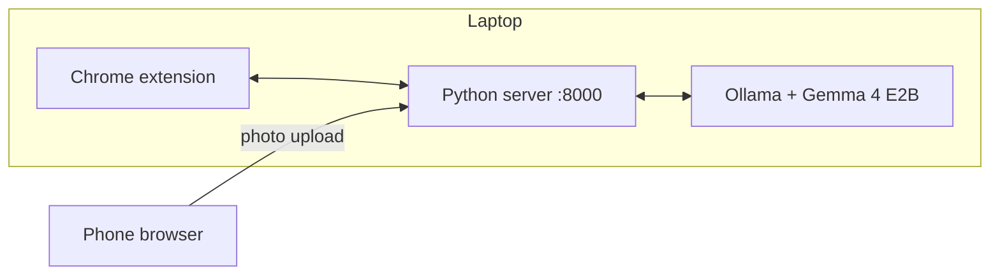

<div align="center">

# 🌿 Outside Leash

**A screen limit you can't click past.**
Hit your daily limit, go outside, send a photo, get your sites back.

Chrome extension · Python server · Gemma 4 E2B via Ollama · 100% local
> ### Built for the Hacktoberfest Open-Source AI Challenge, Week 1: Touch Grass
</div>

---

## Overview

After 20 minutes a day on YouTube, Reddit, Instagram, Facebook or X, the extension sends you to a quest page. You only get back in by sending a photo from your phone that matches the quest. Pass, and the sites unlock for 30 minutes.

Everything runs on your own laptop. No cloud and no API keys.


## How it works



### Architecture



- **Extension** counts time on blocked sites and redirects when the limit is hit.
- **Server** (standard library only) picks a quest theme and handles `/quest`, `/check` and `/status`.
- **Gemma** only words the quest. The yes/no check for each theme is written by hand, so the model can't make the check easier or harder than the quest.
- A quest stays the same until you pass it, so refreshing won't get you an easier one.
- Uploads from the laptop are blocked, so only the phone can finish a quest.
- On the phone, you take the photo in your Camera app and add it on the page. Photos older than 10 minutes are rejected.

## What you need

| Requirement | Notes |
|---|---|
| Windows laptop | Tested on 16 GB RAM, no GPU |
| Python 3 | No extra packages |
| [Ollama](https://ollama.com/download) | With the `gemma4:e2b` model |
| Chrome | For the extension |
| Phone | On the same Wi-Fi as the laptop |

## Folder structure

```
outside-leash/
├── extension/
│   ├── manifest.json        # extension config and permissions
│   └── background.js        # time tracking, blocklist, redirect
├── outside_leash_server.py  # server, quest page, quests and photo check
├── test_check.py            # test script for the photo check
├── test_screen.py           # test script for the screen check
├── log.md                   # build and lockout log
├── .gitignore
└── README.md
```

## Setup

**1. Install Ollama and the model**

Install Ollama from [ollama.com/download](https://ollama.com/download). On Windows, either:

- Run this in PowerShell:
```
  irm https://ollama.com/install.ps1 | iex
```
- Or click **Download manually** on that page and run `OllamaSetup.exe`.

Then open a **new** terminal and pull the model:

```
ollama pull gemma4:e2b
```

**2. Get the code**

```
git clone https://github.com/mauryasagar/outside-leash.git
cd outside-leash
```

**3. Start the server** (keep Ollama running too)

```
python outside_leash_server.py
```

It prints a laptop address and a phone address.

**4. Load the extension**

1. Open `chrome://extensions` in Chrome
2. Turn on **Developer mode**
3. Click **Load unpacked** and pick the `extension` folder

**5. Open the phone address** (like `http://192.168.x.x:8000`) on your phone. Both devices must be on the same Wi-Fi.

If the server is off, the extension does nothing.

## Settings

### Server (`outside_leash_server.py`)

These are near the top of the file. Edit the value, save, and restart the server.

| Setting | Default | What it does |
|---|---|---|
| `MODEL` | `"gemma4:e2b"` | Ollama model used for quests and photo checks |
| `PORT` | `8000` | Port the server runs on |
| `UNLOCK_MINUTES` | `30` | How long sites stay unlocked after a passed quest |
| `THEMES` | 6 themes | Each theme is a quest idea plus its yes/no check question |
| `STYLES` | find, notice, photograph | Verbs the quest can start with |

**Add your own quest theme:** add one line to `THEMES`, in the form `("quest idea", "yes/no question about the photo")`.

### Extension (`extension/background.js`)

These are at the top of the file. After editing, go to `chrome://extensions` and click the reload button on the extension.

| Setting | Default | What it does |
|---|---|---|
| `SITES` | youtube, reddit, instagram, facebook, x, twitter | Sites that count toward the limit |
| `LIMIT_SECONDS` | `20 * 60` | Daily time limit, in seconds |
| `TICK_SECONDS` | `30` | How often the extension checks the active tab |
| `SERVER` | `http://localhost:8000` | Where the server runs |

**Change the daily limit:** edit `LIMIT_SECONDS`. For 10 minutes, write `10 * 60`.

**Block another site:** add its domain to `SITES`, like `"tiktok.com"`.

If you change `PORT` in the server, change `SERVER` in the extension to match.

#

> ### Built for the Hacktoberfest Open-Source AI Challenge, Week 1: Touch Grass

## License

MIT